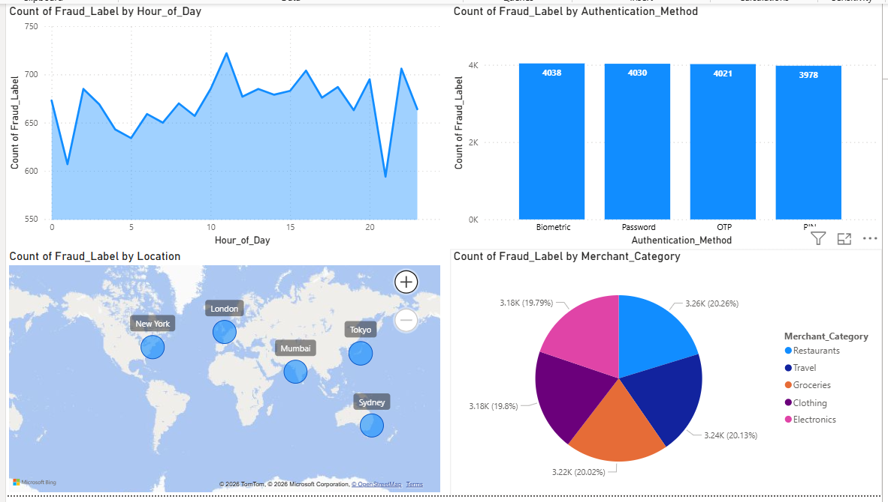

# Enterprise Fraud Detection & Behavioral Risk Analytics Pipeline

## Project Overview
This repository contains an end-to-end data science pipeline designed to ingest transactional ledgers, isolate behavioral features, remediate data leakage, train an ensemble Machine Learning classifier, and deliver a live business intelligence operational dashboard.

* **Data Source:** [Kaggle Fraud Detection Transactions Dataset (by Samay Ashar)](https://www.kaggle.com/datasets/samayashar/fraud-detection-transactions-dataset)
* **Dataset Scale:** 50,000 recorded transaction events mapping 21 historical, financial, and digital attributes.
* **Core Technology Stack:** Python (Pandas, NumPy, Scikit-Learn), Power BI Desktop, Jupyter Notebook architecture.

---

## System Architecture & Workflow Blueprint

The engineering pipeline follows a strict modular production framework:

1. **Ingestion & Integrity Profiling:** Ingesting the data structure, diagnosing null spaces, and running structural class balance checks.
2. **Feature Engineering & Pruning:** * Stripping tracking indices (`Transaction_ID`, `User_ID`) to mitigate high-cardinality parametric overfitting.
    * Parsing mixed object strings into active `datetime64` objects to isolate cyclical `Hour_of_Day` (0–23) variables—capturing midnight automation attack windows.
3. **Categorical Matrix Processing:** Executing One-Hot Encoding across multiple nominal dimensions (`Device_Type`, `Location`, `Transaction_Type`, `Merchant_Category`, `Card_Type`, `Authentication_Method`).
4. **Data Leakage Rectification:** Systematically detecting and purging the pre-calculated `Risk_Score` feature vector to prevent operational model cheating.
5. **Model Training & Evaluation:** Training a balanced Scikit-Learn Random Forest Classifier on an 80/20 stratified validation split.
6. **Downstream Business Layer:** Exporting clean analytical layers for executive visualization.

---

## Machine Learning Model Performance Report Card

After successfully eliminating systemic data leakage (`Risk_Score`), the ensemble model was evaluated against completely unseen test data. The Random Forest engine (`class_weight='balanced'`) yielded highly robust, realistic performance metrics:

| Class | Precision | Recall | F1-Score | Support |
| :--- | :--- | :--- | :--- | :--- |
| **0 (Genuine)** | 0.85 | 1.00 | 0.92 | 6787 |
| **1 (Fraud)** | 1.00 | 0.62 | 0.76 | 3213 |
| **Accuracy** | | | **0.88** | 10000 |
| **Macro Avg** | 0.92 | 0.81 | 0.84 | 10000 |
| **Weighted Avg** | 0.90 | 0.88 | 0.87 | 10000 |

### Strategic Metric Translation:
* **Fraud Precision (1.00 / 100%):** Out of all transactions flagged by the system as malicious, exactly 100% were true positive fraud events. This equates to a **0% False Positive Rate**, guaranteeing that genuine cardholders never experience accidental transaction declines or checkout friction.
* **Fraud Recall (0.62 / 62%):** The model effectively traps and blocks 62% of all active fraud vectors relying exclusively on customer behavioral footprints (transaction velocity, purchase categories, location shifts, and device signatures).
* **Macro Average F1-Score (0.84):** Reflects highly stable and mathematically sound predictive power across both highly imbalanced classification targets.

---

## Executive Fraud Operations Dashboard (Power BI)

To translate raw algorithmic predictions into active business logic, a comprehensive business intelligence tracking layer was connected to the engineered backend data layer:



### Key Operational Components Built:
1. **The 24-Hour Fraud Threat Index:** A time-series distribution line tracking fraud volume by hour of day, pinpointing operational attack windows when manual merchant reviews are offline.
2. **Geographic Distribution Matrix:** A comparative geographic mapping visual detailing regional fraud density and velocity concentrations across global hubs.
3. **Authentication & Merchant Vector Analysis:** Interactive charts pinpointing breakdown rates across transaction types, card types, and digital authentication channels used by active fraud pools.

---

## How to Execute the Pipeline Standalone

### 1. Environment Setup
Ensure an active Python 3.x core environment is established with the baseline statistical dependencies:

```bash
pip install pandas numpy scikit-learn
```

### 2. Sourcing Data
Download the raw database ledger directly from Kaggle. Place the target file inside your local root directory and name it `fraud_dataset.csv`.

### 3. Execution
Run the end-to-end engineering and predictive modeling script directly via your terminal:

```bash
python fraud_risk_pipeline.py
```

Upon successful execution, the script will output the classification report directly to your console and export `cleaned_fraud_visualization.csv` for dashboard loading.

---

*Developed as a data science portfolio project.*
